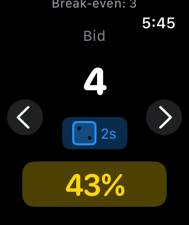
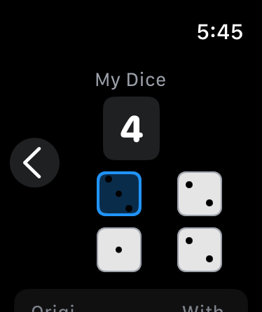

# Liar's Dice Probability Calculator for Apple Watch

A native watchOS app that provides real-time probability calculations for Liar's Dice gameplay. Quickly assess bid probabilities and make informed decisions right from your wrist.

## Screenshots

<table>
  <tr>
    <td align="center">
      
      <br />
      <em>Screen 1: Dice Selection</em>
    </td>
    <td align="center">
      
      <br />
      <em>Screen 2: Probability View</em>
    </td>
    <td align="center">
      
      <br />
      <em>Screen 3: Hand Entry</em>
    </td>
  </tr>
</table>

## Features

- **Real-time Probability Calculations**: Instantly calculate the probability of any bid during gameplay
- **Digital Crown Integration**: Intuitive input using the Apple Watch's Digital Crown for quick adjustments
- **Three-Screen Interface**: 
  - Select total dice in play (1-40 dice)
  - View bid probability with color-coded indicators
  - Enter your hand for conditional probability calculations
- **Color-Coded Probabilities**: 
  - 🟢 Green: ≥50% (favorable odds)
  - 🟡 Yellow: 30-49% (moderate risk)
  - 🔴 Red: <30% (high risk)
- **Break-Even Threshold**: Shows the highest bid with ≥50% probability
- **Conditional Probability**: Advanced feature to calculate probabilities based on your known dice

## Technical Details

- **Platform**: watchOS 10.0+
- **Language**: Swift 5.9
- **UI Framework**: SwiftUI
- **Architecture**: MVVM with ObservableObject state management
- **Probability Engine**: Precomputed lookup tables for binomial probabilities
- **Formula**: P(k|n) = ∑ₓ₌ₖⁿ C(n,x)(1/6)ˣ(5/6)ⁿ⁻ˣ

### Key Components

- `ProbabilityEngine`: Core calculations for bid probabilities
- `ConditionalProbabilityEngine`: Advanced calculations incorporating known dice
- `GameState`: Central state management using ObservableObject
- `HandConfiguration`: Model for managing player's dice configuration

## Installation & Build

### Prerequisites

- Xcode 15.0 or later
- watchOS 10.0+ SDK
- Apple Watch Series 6 or later (or simulator)

### Building the App

1. Clone the repository:
   ```bash
   git clone [repository-url]
   cd liars_dice
   ```

2. Open the project in Xcode:
   ```bash
   open liars-dice-app/liars-dice-app.xcodeproj
   ```

3. Select the Watch App scheme: `liars-dice-app Watch App`

4. Choose your target device (simulator or physical Apple Watch)

5. Build and run (⌘R)

### Running Tests

```bash
xcodebuild test -scheme "liars-dice-app Watch App" -destination 'platform=watchOS Simulator,name=Apple Watch Series 10 (46mm)'
```

## Usage Guide

### Screen 1: Dice Selection
- Use the Digital Crown to select the total number of dice in play (1-40)
- Tap the right arrow to proceed to the probability view

### Screen 2: Probability View
- The break-even threshold (K₀) is displayed at the top
- Rotate the Digital Crown to adjust the current bid
- The probability percentage is shown with color coding
- Tap "My Dice" to enter your hand configuration (Screen 3)
- Tap the left arrow to return to dice selection

### Screen 3: Hand Entry (Optional)
- Set the number of dice you have using the Digital Crown
- Tap each die to select it, then rotate the Crown to set its face value
- View the updated conditional probability compared to the original
- Tap the left arrow to return to the probability view

## Development

### Project Structure

```
liars-dice-app/
├── Models/
│   ├── GameState.swift           # Central state management
│   ├── ProbabilityEngine.swift   # Core probability calculations
│   ├── ConditionalProbabilityEngine.swift
│   └── HandConfiguration.swift
├── Views/
│   ├── DiceSelectionView.swift   # Screen 1
│   ├── ProbabilityView.swift     # Screen 2
│   ├── HandEntryView.swift       # Screen 3
│   └── DieView.swift            # Reusable die component
└── Tests/
    ├── ProbabilityEngineTests.swift
    └── GameStateTests.swift
```

### Performance Optimizations

- Precomputed probability lookup tables for instant calculations
- Efficient state management to minimize re-renders
- Optimized for battery life with dark UI and minimal animations

## Contributing

Please read the contributing guidelines before submitting pull requests.

## License

[License information to be added]